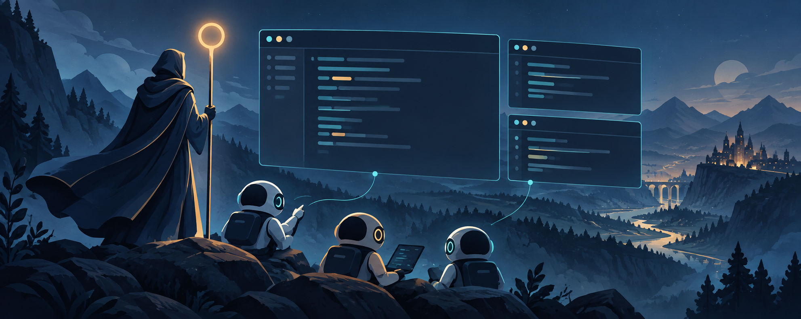

# shepherd



Opens a [Herdr](https://herdr.dev) workspace with a team of coding agents (Claude Code,
Codex) that know from the first second who is who, what their role is and which skills
to use. Teams, roles and stacks are plain files, so growing the team means adding a file.

```
┌──────────────┬──────────────┐
│              │ app-reviewer │
│   app-lead   ├──────────────┤
│              │ app-helper   │
└──────────────┴──────────────┘
```

## Usage

```
shepherd                            # team in the current folder
shepherd ~/coding/app               # team in another folder
shepherd ~/coding/app api           # custom label: api-lead, api-reviewer, ...
shepherd --team squad --stack web   # pick a team and stacks
shepherd --dry-run                  # render prompts and show the plan, open nothing
shepherd list                       # teams, roles and stacks available here
```

You talk to the lead. The lead plans, delegates to helpers over Herdr, sends the diff
to the reviewer and reports back. Look into the other panes when you want to follow
along, or when an agent is `blocked` on a permission prompt only you should answer.

## Stack and team detection

Without `--stack` or `stacks` in `.shepherd.toml`, shepherd picks the stacks whose
`detect` rules match the project, and the stack can also pick the team:

```toml
+++
detect = ["package.json:next", "package.json:react"]   # any rule matching is enough
team = "sf"                                            # optional default team
+++
```

| Rule | Matches when |
|---|---|
| `"sfdx-project.json"` | that file exists in the project folder |
| `"package.json:<dep>"` | `package.json` lists `<dep>` in `dependencies` or `devDependencies` |

| Setting | Precedence (first one set wins) |
|---|---|
| Stacks | `--stack`, then `.shepherd.toml` `stacks` (`stacks = []` turns detection off), then detection |
| Team | `--team`, then `.shepherd.toml` `team`, then the first stack that names a `team`, then `feature` |

The plan line says which stacks were detected, e.g.
`Team 'sf' in /path/to/crm (workspace 'crm', stacks: salesforce (detected))`.
`shepherd list` shows each stack's rules and team.

## Salesforce: the `sf` team

A project with `sfdx-project.json` gets the `salesforce` stack and with it the `sf` team:
one Claude agent (`roles/sf.md`) that works through the
[vibe-force](https://github.com/grzmol/vibe-force) plugin, whose own subagents do the
parallel work. `teams/sf.toml` starts it with:

| Flag | Loads |
|---|---|
| `--plugin-dir ~/coding/apps/vibe-force` | the vibe-force plugin, from a local checkout at commit `11963f7` |
| `--settings {{root}}/settings/salesforce.json` | the production guard hook (below) |

Both are loaded for that agent only, so a plain `claude` in the same project keeps its
usual setup. `shepherd --team duo` (or any other team) still works in a Salesforce
project; those teams get the stack rules but not vibe-force or the guard.

The vibe-force checkout stays at `11963f7` on purpose: the guard's rules for the
vibe-force scripts and MCP tools were written against that version. After updating it,
check the guard and its tests. NetSuite-only projects are not detected, since vibe-force
is Salesforce only; pick the stack and team yourself there.

## Production guard

`hooks/prod-guard.py` is a Claude Code `PreToolUse` hook for the `Bash`, `PowerShell`
and `mcp__*` tools (`settings/salesforce.json`). On production it is an **allowlist**:
only a short list of read-only commands passes, everything else is denied with a reason
telling the agent not to work around it and to hand the command to the user. Calls that
have nothing to do with Salesforce pass silently.

**Which org is production** (fail closed: anything not proven to be a sandbox or scratch
org is production):

1. The target comes from `-o`/`--target-org`/`-u`/`--target-dev-hub` (and `-v` where it
   means the Dev Hub), else `SF_TARGET_ORG`/`SFDX_DEFAULTUSERNAME`, else `.sf/config.json`
   or `.sfdx/sfdx-config.json` up from the working folder (following `cd`), else the
   global config in `~`. No org at all counts as production.
2. Production if it is in `SHEPHERD_PROD_ORGS` (comma-separated aliases, usernames or
   URLs) or its alias or username contains `prod`.
3. Otherwise the alias is resolved through `~/.sfdx/alias.json` / `~/.sf/alias.json` and
   only the `instanceUrl` of `~/.sfdx/<username>.json` is read. A sandbox or scratch host
   has `.sandbox.` or `.scratch.` in it, or is a legacy `mydomain--name.my.salesforce.com`;
   anything else, including a missing auth file, is production.

**When a Bash or PowerShell command touches production:** an `sf`/`sfdx`/`@salesforce/cli`
or vibe-force script invocation in it resolves to a production org; or its text names a
production alias, username or instance host anywhere; or it picks the org in a way the
hook cannot resolve (`--flags-dir`, setting `SF_TARGET_ORG` and friends, a variable as
the target, `HOME=`, `XDG_*=`, `SF_*DIR`).

| Allowed on production | |
|---|---|
| `sf` reads | `data query [resume]`, `data export tree/bulk/resume`, `project retrieve start/preview`, `project deploy validate/report/preview`, `project deploy start --dry-run`, `org list [metadata / metadata-types]`, `sobject describe/list`, `apex get log`, `apex list log`, `apex tail log --skip-trace-flag` |
| `sf api request` | `rest` with an explicit `GET`/`HEAD`/`OPTIONS` and no `--file`; `graphql` with an inline body and no `mutation`/`subscription` |
| no org involved | `--help`/`-h`, `--version`, topics `plugins`, `autocomplete`, `help`, `version`, `which`, `commands`, `doctor`, `update`, `search`, `info`, `whatsnew` |
| vibe-force | `vf-check.mjs` `deploy-validate`, `format`, `lint`, `analyzer`, `pairing`, `jest`, `static`, `local`; `vf-setup.js` `check`, `audit`, `list`, `clean` |
| MCP | tools whose name has a read word (`query`, `describe`, `list`, `get`, `retrieve`, `display`, `search`, `find`) and no write word |

Everything else that touches production is denied, including `org display` (it can print
an access token), `org open`, `org login`, `config set`, `data get record`, legacy
`sfdx force:*`, `api request rest` without a method, unknown plugin commands, and
`vf-check`/`vf-setup` commands not listed above. vibe-force's `VF_ALLOW_PROD` and
`VF_HOOK_MODE` do not switch the guard off. Writes to sandboxes and scratch orgs pass.

Also denied, whatever the org:

| What | Denied when |
|---|---|
| Unreadable commands | an unbalanced quote or nesting deeper than 6, if the command involves Salesforce |
| Inline interpreter code (`python -c`, `node -e`, `perl`/`ruby -e`, `awk`, `osascript`, `deno eval`, code from stdin, ...) | it mentions `sf`, a production org or an unresolvable target; or it can start processes or reach the network and the command involves Salesforce or decodes data |
| Decoded or computed code | encoded PowerShell (`-EncodedCommand`, `-enc`) always; `bash -c "$(...)"`, `eval`/`iex` of a computed string, shells or `source` reading from a pipe or here-document, when the command involves Salesforce or runs a decoder (`base64`, `xxd`, `openssl`, `gunzip`, ...). Decoding alone passes |
| PowerShell forms | `Start-Process`/`saps`, `& sf`, `iex`/`Invoke-Expression`, the backtick escape (`` s`f ``), `$env:SF_TARGET_ORG`, `cmd /c` are normalised and checked like Bash |
| HTTP clients (`curl`, `wget`, `http`, `xh`, ...) | the URL is a Salesforce host that is not a provable sandbox (public docs hosts pass), or the command names a production org |
| MCP tools on a Salesforce-named server, or whose input names a known org | not a read tool, and the org (input keys, known names, URLs, else the default org of a `directory` input) is production or missing |
| Browser MCP tools (`playwright`, `browser`, `puppeteer`, `chrome`, `browser_*`) | any string argument, also percent-decoded twice, holds a production instance host or a Salesforce host (`*.salesforce.com`, `force.com`, `site.com`, `visualforce.com`, ...) that is not a provable sandbox; in code tools that navigate, any Salesforce fragment outside a safe host |

The hook never runs `sf` and reads nothing from auth files but `instanceUrl`. Deny
messages name an org only when it is a known alias or username, never echo other input,
and never contain tokens. An internal error denies the call if it involves Salesforce.

**Tests** use a fake home with fixture auth files and never run `sf`. They include
`tests/attack_corpus.jsonl`, 110 adversarial cases (Bash, PowerShell, MCP; each with an
expected allow or deny) written by an independent reviewer:

```
python3 -m unittest discover -s tests -v
```

**Limitations.** The guard is a safety net, not a guarantee:

- It reads the command, not the files it runs: `bash deploy.sh`, `python sync.py`,
  `npm run deploy` or a Makefile can call `sf` or the API unseen (the two vibe-force
  scripts are the exception, since their arguments are known).
- Browser checks see tool arguments only: redirects after a page loads, clicks on links
  whose target is not in the arguments, and form submits on an already open page are not
  seen. Custom production domains are only known when their auth file is local.
- MCP servers and tools are judged by name: a Salesforce server with a neutral name (and
  no known org in its input), or a writing tool named like a read (`get_...`), passes.
- Only sessions started with `settings/salesforce.json` are guarded (the `sf` team);
  other teams, a plain `claude` and Codex are not.

The real guarantee is a session with no production credentials at all. `roles/sf.md`
and `stacks/salesforce.md` also tell the agent to refuse production writes whatever the
hook allows.

## How it fits together

| Piece | File | What it is |
|---|---|---|
| Shared rules | `team.md` | Rules every agent gets, plus the generated roster table |
| Role | `roles/<role>.md` | One job: front matter (`kind`, `description`, `skills`) + instructions |
| Team | `teams/<team>.toml` | Which roles to open, in what order, how many of each, extra CLI args |
| Stack | `stacks/<stack>.md` | Technology rules and skills for a kind of project; `detect` and `team` for auto-detection |
| Claude settings | `settings/<name>.json` | Extra settings passed with `--settings` by a team (e.g. hooks) |
| Hooks | `hooks/prod-guard.py` | The production guard for the `sf` team |
| Tests | `tests/` | Tests for the hooks (`python3 -m unittest discover -s tests -v`) |
| Project config | `<project>/.shepherd.toml` | Default team, stacks, label and free-text context |
| Project overrides | `<project>/.shepherd/` | Same layout as this repo; a file here wins for that project |

Each agent's prompt is `team.md` + its role + its skills + the stacks + the project
context, rendered to `~/.cache/shepherd/<label>/<agent>.md`. Claude gets it through
`--append-system-prompt-file`, Codex through `-c developer_instructions=...`. It is
added to the agent's own setup (CLAUDE.md, AGENTS.md, memory), not a replacement.

Placeholders in `team.md`, roles and stacks: `{{self}}`, `{{label}}`, `{{dir}}`,
`{{roster}}` and `` (names of the agents with that role, comma-separated, or
"(none in this team)").

The first agent in a team opens on the left, the rest are stacked evenly on the right.

## Extending

**New role:** add `roles/tester.md`:

```markdown
+++
kind = "claude"            # or "codex"
description = "writes and runs end-to-end tests"

[skills]
"run" = "starting the app for a test run"
+++
You write end-to-end tests for what {{lead}} asks for...
```

then add it to a team:

```toml
[[agents]]
role = "tester"
```

**More of one role:** `count = 2` gives `<label>-helper-1` and `<label>-helper-2`.
**Custom agent name:** `name = "qa"` gives `<label>-qa`.
**Extra CLI flags for one agent:** `args = ["--model", "opus"]`. A leading `~` and
`{{root}}` (this repo) are expanded in each argument, also in `--flag=value` form:
`args = ["--settings={{root}}/settings/salesforce.json"]`.

**New skill:** add a line under `[skills]` in a role (only that role gets it) or in a
stack (everyone in projects with that stack gets it). The line says when to use it.

**New stack:** add `stacks/<name>.md`, then either list it in a project's
`.shepherd.toml` or give it `detect` rules (and optionally a `team`) so matching
projects get it automatically.

**Hooks or settings for one team:** put a settings file in `settings/` and pass it with
`args = ["--settings", "{{root}}/settings/<name>.json"]`. `{{root}}` inside a settings
file (e.g. the hook command) is replaced with this repo's path in a rendered copy under
`~/.cache/shepherd/<label>/`, so the repo can live anywhere.

**New agent tool** (e.g. Gemini): add an entry to `KINDS` in `bin/shepherd` that says
how that CLI receives extra instructions.

## Agent names in the sidebar (herdr-radar)

With the [herdr-radar](https://github.com/hhdebb/herdr-radar) plugin, `herdr/radar-hook.js`
puts each agent's name in front of its sidebar title (`lead · Claude Code` under the
`uigen` header). Enable it in `~/.config/herdr/plugins/config/hhdebb.herdr-radar/config.toml`:

```toml
render_hook = "/Users/<you>/coding/apps/shepherd/herdr/radar-hook.js"
```

then restart the plugin: `herdr plugin action invoke hhdebb.herdr-radar.state-start`
(after a `state-stop` that has finished). The hook is loaded once per start, so edits
to it also need a restart.

## Install

```
ln -s ~/coding/apps/shepherd/bin/shepherd ~/.local/bin/shepherd
```

Needs Python 3.11+ (for `tomllib`) and Herdr. The `sf` team also needs the vibe-force
checkout at `~/coding/apps/vibe-force`.

## License

MIT, see [LICENSE](LICENSE).
